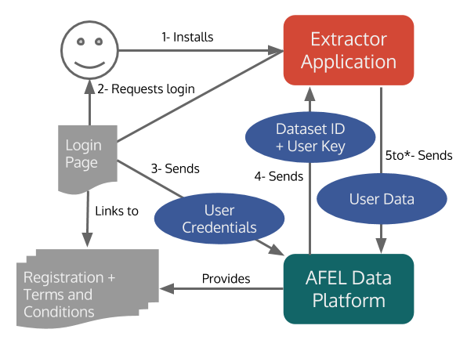

# AFEL Browsing History WebExtension
Contributors: Mathieu d'Aquin (@mdaquin), Alessandro Adamou(@anticitizen79)

The AFEL Browsing History WebExtension is one of the Browsing History Extractors developed in the [AFEL Project](http://afel-project.eu). It is a browser add-on running in the background while you use the browser in the Web, and sends information about your browsing to the [AFEL Data Platform](http://data.afel-project.eu). It will require login onto the AFEL Data Platform, either with an existing account or through registration.

This add-on has been developed as a WebExtension, the preferred format for browser extensions that will become a standard by 2017.

## Requirements

This WebExtension works on any of the following browsers:
- Google Chrome
- Firefox version 50.0 and above ([released Nov 2016](https://wiki.mozilla.org/RapidRelease/Calendar))
- Opera version 33 and above
- Vivaldi

_Microsoft Edge_ is expected to be the next to support this standard.

## Installation 
Currently, there is no signed/packaged version of this extension, so you have to install it as an unpackaged extension after setting your browser to accept developer-mode extensions.

1. Download or git clone into a local directory. 
2. In Chrome, go to settings, and choose extensions on the right hand menu (View -> Show Extensions in Opera, Add-ons in Firefox)
3. At the top of the page, click on "Developer mode" if not already enabled. 
4. Use "Load unpacked extension" to select the directory where the extension has been downloaded.

Please make sure to read and accept the [Terms and Conditions](http://data.afel-project.eu/catalogue/index.php/terms-browsing/) before downloading and activating this browser extension.

## Use
As soon as the extension is enabled, a new tab should appear in your browser showing a login page to the AFEL data platform. Please (register)[http://data.afel-project.eu/catalogue/wp-login.php?action=register] if you don't already have an account. Once logged in, the extension will have obtained all the details needed to updload data about browsing activity on the AFEL Data Platform. A small icon will have also appeared on the right hand side of the browser's address bar, showing that the extension is active. Clicking on this icon will give you a link to the [AFEL User Dashboard](http://data.afel-project.eu/catalogue/index.php/user-dashboard/) where you can monitor your own activity from this and other AFEL extractors.

## Workflow

This chrome extension represents a typical form of user-centric data extractor for the AFEL Data Platform. As such, it is worth detailing the workflow through which this interaction happens. This workflow is described in the diagram below.

where the Extractor application here is the extension and the login page is achieved through a local tab.

The API to provide dataset ID and user key in the platform is part of the [Data Catalogue](https://github.com/afel-project/datahub-catalogue), through the [Data Catalogue Process Plugin](https://github.com/afel-project/data-catalogue-process-wordpress). The actual use data (in this case, browsing activity data), is transferred to the AFEL Data Platfrom through the [Entity Centric API](https://github.com/afel-project/entity-centric-api).

## Getting your own data
In addition to showing activity through the AFEL user dashboard, the AFEL Browsing History Extension will also update three API endpoints from which data can be obtained using the users unique API key. To use them, apply for example:

`curl -u [your-api-key:] http://data.afel-platform.eu/api/entity/day/today`

to get activities for the current day. 

You can also use:
- http://data.afel-platform.eu/api/entity/day/25-08-206 (for example) for the a specific day
- http://data.afel-platform.eu/api/entity/month/current for the current month
- http://data.afel-platform.eu/api/entity/month/08-2016 (for example) for a specific month
- http://data.afel-platform.eu/api/entity/year/current for the current year
- http://data.afel-platform.eu/api/entity/year/2016 (for example) for a specific year

Note that these endpoints might also include data obtained from other extractors.

## Licence 
The AFEL Chrome Browsing History Extension us distributed under the [Apache Licence V2](https://www.apache.org/licenses/LICENSE-2.0). Please attribute *[Mathieu d'Aquin](http://mdaquin.net) and [Alessandro Adamou](http://kmi.open.ac.uk/people/member/alessandro-adamou) from [The Open University](http://www.open.ac.uk) through the [AFEL Project](http://afel-project.eu)* when reusing and redistributing this code.
